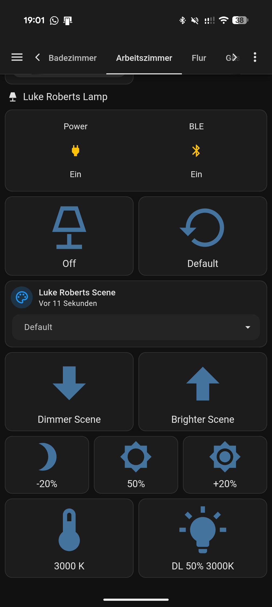
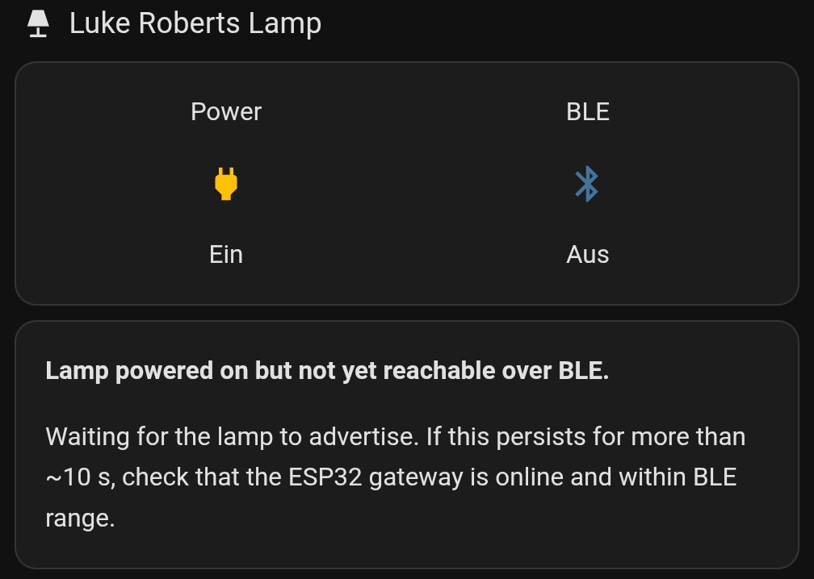

# Luke Roberts Lamp – ESPHome Gateway

> Control a Luke Roberts smart lamp from Home Assistant via an ESP32 BLE bridge.

ESPHome configuration that turns an **ESP32** into a Bluetooth-LE gateway for
**Luke Roberts** smart lamps (Model F / Luvo). Exposes the lamp as a set of
Home Assistant buttons, binary sensors and text sensors — no mobile app
required after initial setup.

<p align="center">
  
</p>

Built against the official **[Lamp Control API v1.3](docs/Lamp%20Control%20API%20v1.3.pdf)**
(Luke Roberts, 2019-07-09).

## Features

- Scene selection for up to **16 scenes (ids 0–15)**, plus *Off* (id 0) and
  *Default* (id 255 — the power-up scene), addressable either via individual
  buttons or a single **Scene** dropdown (`select` entity)
- **Automatic scene-name discovery** on connect — walks the lamp's scene list
  via the Query Scene opcode and publishes each name as a separate HA text
  sensor, plus a combined "Scenes Overview" summary string
- Manual "Refresh Scenes" button to re-walk the list on demand
- Brightness adjustment (absolute percent, relative multiplier, next brighter / dimmer)
- Color temperature (2700 K – 4000 K)
- Immediate Light command (transient brightness + kelvin)
- Live protocol response decoding (OK / Invalid Id / Bad Command / Forbidden …)
- Device Information read-out (manufacturer, model, serial, FW/HW/SW revisions)
- Ping-based keepalive so successive commands fire in < 100 ms

## Hardware

- Any ESP32 board with BLE. Tested on an **ESP32-S3-WROOM-1**
  (`esp32-s3-devkitc-1`). Change the `esp32.board` value in
  [`luke-roberts-lamp.yaml`](luke-roberts-lamp.yaml) for other modules.
- A Luke Roberts smart lamp within Bluetooth range (typically < 10 m line of sight).

## Quickstart

1. **Clone the repo** into your ESPHome config directory, or drop
   `luke-roberts-lamp.yaml` into it directly.

2. **Find your lamp's MAC address.** Easiest way: power on the lamp, open the
   Luke Roberts app and connect to it — the MAC is shown in the lamp's
   Bluetooth details on most phones. Alternatively, temporarily add
   `esp32_ble_tracker:` to any ESPHome config and grep the log for
   `LRBTLAMP` / `Luvo` / the lamp's advertised name.

3. **Configure secrets.** Copy `secrets.yaml.example` to `secrets.yaml` (next
   to your ESPHome configs) and fill in your Wi-Fi credentials.

4. **Edit `luke-roberts-lamp.yaml`** — replace at minimum:
   - `lr01_mac` with your lamp's MAC
   - `encryption_key` with a fresh 32-byte base64 API encryption key
   - `ota_encryption_key` with an OTA password
   - `ap_fallback_pw` with a fallback AP password

5. **Compile and flash** via the ESPHome dashboard or CLI:

   ```bash
   esphome run luke-roberts-lamp.yaml
   ```

6. **Adopt in Home Assistant.** The device should appear automatically via
   mDNS. If not, add it by hostname.

## Command reference

All payloads are written to characteristic
`44092842-0567-11E6-B862-0002A5D5C51B` on service
`44092840-0567-11E6-B862-0002A5D5C51B`. Every frame starts with `A0` followed
by API-version `01` or `02`.

| Button in HA                     | Opcode | Payload (hex)         | Notes                                          |
| -------------------------------- | :----: | --------------------- | ---------------------------------------------- |
| Ping                             | 00     | `A0 02 00`            | Returns `00 VV` – lamp's max API version       |
| Lamp Off                         | 05     | `A0 02 05 00`         | Scene id 0 = Off                               |
| Default Scene                    | 05     | `A0 02 05 FF`         | Power-up scene                                 |
| Scene 1 / 2                      | 05     | `A0 02 05 01` / `02`  | User-defined scenes from the Luke Roberts app  |
| Brightness 50 %                  | 03     | `A0 01 03 32`         | Absolute, percent 0..100                       |
| Color Temperature 3000 K         | 04     | `A0 01 04 0B B8`      | Kelvin big-endian, clamped to 2700..4000       |
| Next Brighter Scene              | 06     | `A0 02 06 01`         | Signed direction, +1                           |
| Next Dimmer Scene                | 06     | `A0 02 06 FF`         | Signed -1                                      |
| Brighter (+20 %) / Dimmer (-20 %)| 08     | `A0 02 08 78` / `50`  | Multiplicative relative brightness             |
| Immediate: Downlight 50 % 3000 K | 02     | `A0 01 02 02 0000 0BB8 80` | Flags=downlight, duration=infinite, BR=128 |
| Query Scene (id N)               | 01     | `A0 01 01 NN`         | Response carries next-id + UTF-8 name           |

See the [API PDF](docs/Lamp%20Control%20API%20v1.3.pdf) for the full frame layout,
response codes, and the Immediate Light uplight (HSB) sub-packet.

## Response decoding

Each write triggers a notification carrying the status byte:

| Byte | Meaning           |
| ---- | ----------------- |
| `00` | Success           |
| `81` | Invalid Params    |
| `84` | Invalid Id        |
| `87` | Invalid Version   |
| `BC` | Bad Command       |
| `FC` | Forbidden (lamp has a security code set via the app) |

The decoded response is published live to the HA text sensor
**`Luke Roberts API Response`** (diagnostic category).

## Scene discovery

On every successful connect (and on demand via **Refresh Scenes**) the gateway
walks the lamp's scene list using the `Query Scene` opcode (`A0 01 01 NN`):

1. Start at id `0x00`.
2. Each response looks like `00 01 NN <utf-8 name bytes> 00`, where `NN` is
   the next valid scene id (or `0xFF` when the end of the list is reached).
3. The gateway publishes the decoded name to `sensor..._scene_N_name` and
   fires the next query after ~100 ms, stopping at `0xFF` or any error.

The names are then available as:

- `sensor.esp32_s3_luke_roberts_gateway_scene_N_name` (one per id, 0–15)
- `sensor.esp32_s3_luke_roberts_gateway_scenes_overview` — a combined
  `"0: Off | 1: Reading | 2: Movie | 3: Evening | …"` string, handy for a
  single-glance display

Only id 0 (Off) and any configured user scenes return a name — unconfigured
slots remain empty.

## Scene dropdown (`select` entity)

For single-click control, the gateway exposes `select.<name>_scene` with a
fixed options list:

```
Default, Off (0), 1, 2, 3, 4, 5, 6, 7, 8, 9, 10, 11, 12, 13, 14, 15
```

Selecting an option fires `Select Scene` (`A0 02 05 NN`) — `Default` maps to
`0xFF`, the others to their numeric id. The options are **static** because
HA only fetches an ESPHome entity's options list once on connect, so the
discovered scene *names* are intentionally **not** merged into the dropdown
labels. Instead, the companion `Scenes Overview` text sensor beside it shows
`"0: Off | 1: Reading | 2: Movie | …"` so you can tell at a glance which
id maps to which configured scene.

### Optional: pretty-named dropdown on the HA side

If you want a dropdown whose options actually read `"1: Welcome!"`,
`"2: Highlights"`, … instead of bare ids, drop the package under
[`home-assistant/`](home-assistant/) into your HA config. It creates an
`input_select.lr_scene` helper and two automations that keep the option list
in sync with the discovered scene-name sensors and translate a selection
into the matching button press on the gateway. See
[`home-assistant/README.md`](home-assistant/README.md) for install steps.


## Connection behaviour

- Luke Roberts lamps with firmware ≥ 1.1.1 **drop the BLE link after ~8 s of
  inactivity**.
- `auto_connect: true` makes ESPHome reconnect automatically whenever the
  lamp is in range.
- A ping keepalive (`A0 02 00`, every 6 s) runs for 30 s after the last user
  command, so follow-up commands complete in < 100 ms without having to
  re-establish the link. Once the user goes idle the pings stop and the lamp
  is free to sleep.
- If the link happens to be down when you press a button, `lr_send` transparently
  reconnects before writing — just with a one-off latency of 1–2 s.

## File layout

```
.
├── README.md
├── LICENSE
├── luke-roberts-lamp.yaml             # the ESPHome config
├── secrets.yaml.example               # Wi-Fi credential template
├── dashboard/
│   ├── README.md
│   ├── lamp-card.yaml                 # main Lovelace card (everyday controls)
│   └── diagnostics-card.yaml          # admin Lovelace card (ping / restart / …)
├── home-assistant/
│   ├── README.md
│   └── packages/
│       └── lukeroberts.yaml           # optional dynamic scene dropdown package
└── docs/
    ├── Lamp-Control-API-v1.3.pdf
    ├── dashboard.png                  # screenshot: lamp reachable
    └── dashboard2.png                 # screenshot: lamp not yet reachable
```

## Dashboard

<p align="center">
  
  &nbsp;&nbsp;
  
</p>

*Left: lamp reachable – full control panel with scene picker, brightness and
color-temperature controls. Right: lamp powered on but not yet reachable over
BLE – waiting notice.*

Two Lovelace snippets are provided under [`dashboard/`](dashboard/):

- [`lamp-card.yaml`](dashboard/lamp-card.yaml) – main card for everyday use.
  Switches automatically between three states via `conditional` cards:
  - **mains off** → only the status glance row is shown
  - **mains on, BLE not reachable** → a short waiting notice
  - **mains on, BLE reachable** → full control panel (Off / Default, pretty-
    named scene picker, Dimmer/Brighter scene, brightness ±20 % / 50 %,
    color temperature)
- [`diagnostics-card.yaml`](dashboard/diagnostics-card.yaml) – admin card
  with Ping / Restart / Refresh scenes / last API response / device info,
  gated by a `visibility:` block so it's only rendered for a specific HA
  user id and while the mains switch is on.

The main card uses only core HA cards plus optionally
`custom:mushroom-select-card` (HACS) for the scene dropdown. If you don't
have Mushroom, swap that block for a plain `entities` card listing
`input_select.lr_scene`.

Before pasting, replace the placeholders in both files:

- `light.your_lamp_power_switch` → whatever switch feeds mains to your lamp
- `REPLACE_WITH_YOUR_HA_USER_ID` (diagnostics card) → your HA user id

See [`dashboard/README.md`](dashboard/README.md) for install instructions and
the full list of entity ids the cards reference.

## Extending

Ideas that fit cleanly on top of this base:

- **Unified `light.template` entity** — expose brightness + color-temperature
  through a single HA light instead of separate buttons (uses `03` + `04`
  under the hood).
- **Long-press / click-detection passthrough** if you mount the ESP near the
  lamp and want it to mirror the click events.
- **Active-scene feedback** — the protocol has no "currently active scene"
  query, so the `select` entity tracks the last command sent rather than the
  lamp's actual state. A future extension could persist that via
  `restore_value: true` or mirror manual app changes through another channel.

Pull requests welcome.

## GitHub repo description (suggested)

Short one-liner for the GitHub repo's "About" field:

> Control Luke Roberts smart lamps (Model F / Luvo) from Home Assistant via an
> ESPHome BLE gateway. Scenes, brightness, color temperature.

**Topics:** `esphome` `home-assistant` `luke-roberts` `smart-lamp` `bluetooth-le`
`esp32` `ble-gateway`

## Credits

- Luke Roberts GmbH — for publishing a clean, documented external control API.
- The ESPHome project — for making this kind of glue trivial to write.

## License

MIT – see [LICENSE](LICENSE).
